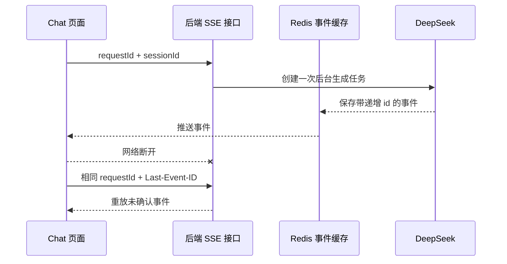
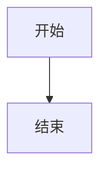

# Neura Chat 前端

这是一个基于 Vue 3 + TypeScript + Vite 的 AI 聊天前端。本文只说明 AI 聊天相关功能、技术栈和代码结构。

## 技术栈与第三方库

| 类别 | 技术/库 | 用途 |
| --- | --- | --- |
| UI 框架 | Vue 3 | 聊天页面和响应式状态 |
| 语言 | TypeScript | API、SSE、消息和渲染节点类型约束 |
| 构建 | Vite | 本地开发、构建和代码分割 |
| 状态 | Pinia | 用户登录信息和令牌状态 |
| UI 组件 | Element Plus | 登录和通用交互组件 |
| HTTP | Axios、Fetch | 普通接口和流式 SSE 请求 |
| Markdown | unified、remark-parse、remark-gfm、remark-rehype、rehype-stringify | Markdown 解析和 HTML 转换 |
| 代码高亮 | Shiki、@shikijs/langs、@shikijs/themes | JavaScript、TypeScript、Python、JSON、Bash 高亮 |
| 图表 | Mermaid | `mermaid` fenced code block 渲染为 SVG |
| 安全 | DOMPurify | 清理 `v-html` 前的 HTML/SVG，防止 XSS |
| 测试 | Vitest、Vue Test Utils、jsdom | SSE、API、会话和 Markdown mock 测试 |

## AI 聊天代码结构

```text
src/
├── api/
│   └── chat.ts              # 聊天、会话列表、会话历史 API
├── utils/
│   ├── chat-stream.ts       # SSE 分片解析、UTF-8 解码、事件 ID 和取消
│   └── markdown.ts          # Markdown、Shiki、Mermaid、DOMPurify
└── views/
    └── chat.vue             # 聊天页面、会话切换、发送和停止生成

tests/
├── api/chat.spec.ts
├── utils/chat-stream.spec.ts
├── utils/markdown.spec.ts
└── views/chat.spec.ts
```

## 已实现功能

### 1. 流式聊天

- 使用 `fetch` 请求 `text/event-stream`。
- 支持网络 chunk 与 SSE 事件边界不一致的情况。
- 支持 LF、CRLF 和没有结尾空行的 SSE 数据。
- 使用 `TextDecoder(stream: true)`，避免中文 UTF-8 字符被分片时乱码。
- 只把 `choices[0].delta.content` 增量追加到当前 assistant 消息。

### 2. 断线重连

一次生成涉及三个不同标识：

| 标识 | 作用 |
| --- | --- |
| `sessionId` | 标识一段独立多轮会话，后端以它读取历史上下文 |
| `requestId` | 标识一次模型生成，请求重连时必须保持不变 |
| `Last-Event-ID` | 告诉后端前端已经收到的最后一个 SSE 事件 |

断线后的流程：



### 3. 取消请求

- 每次生成使用独立的 `AbortController`。
- `AbortSignal` 同时传给 `fetch` 和 SSE reader。
- 取消时主动调用 `reader.cancel()`。
- 重连等待也绑定 `AbortSignal`，停止后不会继续等待或重试。
- 已经收到的 assistant 内容会保留，不会被错误提示覆盖。

### 4. 多轮会话

- 每个新对话生成独立的 `sessionId`。
- 同一会话的多轮消息复用同一个 `sessionId`。
- 前端每轮只发送当前用户 prompt，不发送完整历史。
- 后端根据 `sessionId` 组装模型上下文。
- 页面启动时加载最近会话列表。
- 切换会话时按需加载完整历史。
- 切换完成后自动定位到该会话最后一条用户 prompt。

### 5. Markdown 增量渲染

assistant 内容收到增量后按帧调度 Markdown 渲染，减少高频 token 导致的重复解析。

渲染链路：

```text
Markdown 文本
  -> remark-parse / remark-gfm
  -> remark-rehype
  -> Shiki 代码高亮 / Mermaid SVG
  -> rehype-stringify
  -> DOMPurify
  -> v-html
```

历史会话加载后，会批量渲染全部 assistant 消息；流式生成过程中只更新最新 assistant 消息。

### 6. Shiki 代码高亮

当前支持：

- JavaScript / JSX
- TypeScript / TSX
- Python
- JSON
- Bash / Shell

Shiki 采用动态加载，只有遇到支持的代码块时才初始化高亮器。未知语言保留普通代码块，不影响正文显示。

### 7. Mermaid 图表

当 assistant 返回以下格式时触发 Mermaid：

````markdown

````

Mermaid 使用 `securityLevel: strict`，生成 SVG 后再经过 DOMPurify 清理。语法不完整或非法时降级为普通代码块。

### 8. 会话界面状态

- 空会话状态
- 历史会话加载状态
- 首字到达前的“正在思考”状态
- 流式生成状态
- “停止中”状态
- 网络错误兜底提示
- 生成期间禁用新建和切换会话，避免 token 写入错误会话

## 业务流程

```text
用户输入 prompt
  -> 前端追加 user 消息
  -> 生成/复用 sessionId
  -> 生成 requestId
  -> POST /api/chat/deepseek/stream_chat
  -> SSE 解析 delta
  -> 更新 assistant.content
  -> 增量 Markdown 渲染
  -> Shiki/Mermaid 处理
  -> DOMPurify 清洗
  -> 页面显示
```

## 主要接口

| 方法 | 地址 | 用途 |
| --- | --- | --- |
| `GET` | `/api/chat/deepseek/conversations` | 获取当前用户最近会话摘要 |
| `GET` | `/api/chat/deepseek/conversations/{sessionId}` | 获取会话历史 |
| `POST` | `/api/chat/deepseek/stream_chat` | 发起或恢复流式聊天 |

会话历史接口兼容后端两种返回形式：

```json
{ "id": "...", "messages": [] }
```

以及统一包装形式：

```json
{ "code": 200, "message": "success", "data": { "id": "...", "messages": [] } }
```

## 开发与验证

```bash
npm install
npm run dev

npm test -- --run
npm run type-check
npm run type-check:tests
npm run lint
npm run build
```

## 当前边界

- 会话历史由后端 Redis 保存，前端只负责展示和切换。
- Markdown、Shiki、Mermaid 相关渲染发生在前端。
- Mermaid 依赖较大，构建时可能出现 chunk 体积提示，但不影响功能。
